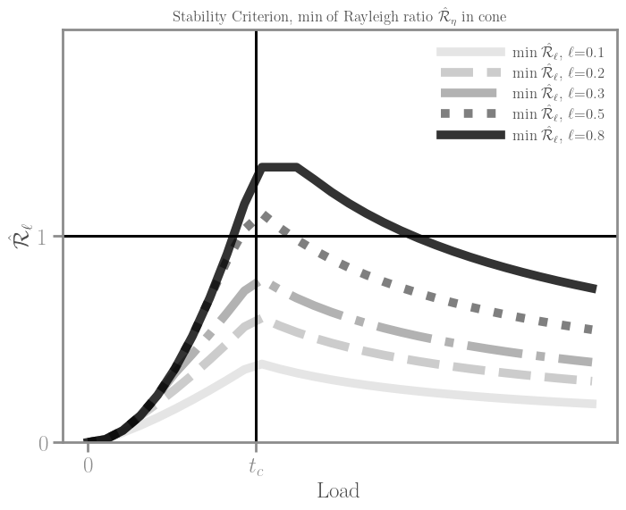

# Summary

Title: Understanding Stability in Evolutionary Systems: Navigating Continuity and Discontinuity

Abstract:
This article explores the role of stability in various scientific domains, ranging from mechanics to ecology and quantum physics. It delves into the intricate dynamics of evolutionary processes, characterized by both gradual, continuous shifts and occasional abrupt transitions. In examining these phenomena, we challenge the axiom "Natura non facit saltus" (Nature does not make jumps), highlighting the importance of rare transformative events.

# Summary:
This section introduces the overarching theme of stability in scientific disciplines, emphasizing its significance in comprehending complex systems. The focus is on the nuanced dynamics of evolutionary processes, incorporating both gradual and abrupt changes.


the existence and nature of bifurcations and the stability of the bifurcating solutions are completely determined by variational analysis of the nonlinear .... which arise from the energy/variational methods of ....


the main application of ____________ is in the study of evolutionary problems  
functional analysis of problems of bifurcation...posed in spaces of high or infinite dimension.
symmetry brealking bifurcations, 

.. 
general enough to in principle apply to a large variety of applications that arise in science, technolgu, economy and social sciences
simple enough so that it can be understood/played with by ... training extends beyond the classical methods 


this contribution is concernted with the aplpication of f variational, direct, energy methonds in the calculus of variations to the sutdy of evolutionary systems, based on a notion of stability

the solvers discussed in this contribution can be exgtended or adapted to other evolutionary systems arising from partial differential equations.


we study localbifurcations of vector fields and maps

changes may occur in the qualitative structure of the solutions for certain parameter values, these changes are called bifurcations and the parameter values are the bifurcation values

structurally unstable systems, 

lack the satisfying completeness of the structural stability theory for second order system

in a n example, we shall focus upon the fundamental proble of a bar in traction

nonlinear systems can have surprising and complecated behavuours

nonlinear phenomena include ..... 
formation of spatial patterns in homogeneous systems, biological morophogenesis, discrete-time and discrete-space nonlinear systems (cellular automata) provide models for processes ranging from the micro (particle phusics) to patterned activity... in evolutionary systems

stability not determined by a /the linearised system

stabilit of equilibrium states in singular (critical?) setting.
nonlinear analyss

the problem of stability is considered under fullfilment of conditions of ... (degeneracuy) eigenvalues of a linearised system become zero

the tools of modern mathematical analuysis allow us to ... and make more transparent the study of stability of critical states.
transformation of a global inequality into a .... series of problems, 
reduction theorems, allowing us to extract from each problem its essential part.

the role of constraints
the peculiarity of our problem

natural system, physical, chemical, or biological, 
phenomenolofical novelty


full investigation of bifurcations in the neighbourhppd of ... can be carried out exhaustively


We work on

a rate indepedent system, evolutionary material models, shape memory alloys that are flexible enough to encommas nonlinear and nonconvex phenomena as well as singular phenomena.


monotone temporal rescaling of the input leads to the crrespondingly rescaled output

rate indipendence separation of temporal scales


analysis of equilibrium stability ... a number of computing issues

touch directly upon these aspects
our programs are at present available to perform all the necessary calculation


-------


Certainly, considering the context of scientific computation for a numerical code that addresses stability problems in the domains of theoretical mechanics, mathematical analysis, and related fields, here is a concise statement of needs:

"A robust scientific numerical code is required to analyze and predict the stability of dynamic systems, evolutionary models, and mathematical constructs. This code must offer advanced stability analysis tools for exploring bifurcations, chaos, and nonlinear dynamics. Additionally, it should support the development of stable control systems, enable ecological modeling with a focus on resilience, and contribute to the stability considerations in quantum mechanics. The code should facilitate precise simulations, aiding in the design of stable trajectories for space exploration. Overall, the code must be versatile, efficient, and scalable, meeting the diverse stability analysis needs across scientific disciplines."


Analyzing the stability of evolutionary models in biological systems.
Predicting the behavior of quantum states in quantum mechanics.
Designing stable control systems for technological applications.
Estimating natural frequencies in structural engineering.
Assessing the stability of orbits for space exploration.


facilitating interdisciplinary research and discoveries in complex systems' behavior. 
The open-source nature of the software encourages collaboration, enabling researchers to build upon and extend the code for new scientific investigations.


we are developing a versatile numerical platform poised to revolutionize stability estimation across diverse scientific domains. This innovative platform, founded on a robust mathematical backbone, transcends traditional boundaries, making it applicable to fields from quantum mechanics to ecological modeling. Its openness and adaptability empower researchers, providing them with a unified solution for stability analysis. This tool is not only transparent but also accommodates large-scale computations, ensuring accuracy and reliability. Beyond its immediate applications, such as predicting Antarctic ice shelf stability, the platform fosters collaboration through an open-source model. With user-friendly interfaces and advanced stability analysis tools, this project signifies a pivotal shift in our ability to understand and analyze the stability of complex systems, impacting both applied and theoretical research.


State of the Art-Scientific Context:
Current stability analysis tools lack adaptability and transparency, hindering interdisciplinary research. Existing methodologies often address specific domains, leaving a void for a comprehensive platform suitable for ecological modeling, quantum mechanics, and more.

# Statement of Needs:

Addressing stability in evolutionary systems requires understanding the coexistence of smooth evolutions and abrupt transitions. 

Current methods fall short in capturing this dual nature. 

This contribution offers a problem and its numerical proof (of sufficiency), highlighting the implementation of three numerical solvers that allow to set up a comprehensive numerical platform capable of computing evolutionary trajectories for complex systems and their bifurcation and stability analysis. 

This responds to the need for a _______ stability principle ____________ across diverse domains.
Crucially, constraints play a prominent role.

In order to compute fracture evolution ...
we needa a robust scientific numerical code is to analyze and predict the stability of evolutionary systems, rapidly test different models and scenarios, supported by exploiting general mathematical constructs. 

Mathematical problems of stabilty require advanced analysis tools for exploring bifurcations, chaos, and nonlinear dynamics. Additionally, it should support the development of stable control systems, enable ecological modeling with a focus on resilience, and contribute to the stability considerations in quantum mechanics. The code should facilitate precise simulations, aiding in the design of stable trajectories for space exploration. Overall, the code must be versatile, efficient, and scalable, meeting the diverse stability analysis needs across scientific disciplines.”

release three flexible solvers that implement three increasingly
difficult analytical problems whose peculiarity is the presence of singular nonlinear constraints. Variational (vector) inequality, Variational eigen-inequality, Cone-constrained eigen-inequality.
Individually, problems of this type arise in many fields of science, both conceptually and mathematically.

sharing a motivation that
naturally arises
in the study evolving systems under constraints,
at the intersection between mathematical analysis, theoretical mechanics and numerical methods.


XXXXXXX is a computational platform/series of solvers for incremental problems under constraints dynamics. FEniCE
enables wrapping high-level mathematical constructs (e.g., Energies, boundary conditions, ) without losing
full flexibility and configuration of the underlying linear algebra backend (PETSc). The ease-of-use of ________ ___. API for XXXXX is designed designed to receive an abstract energy functional, and user-friendly description of the state (as an object in a functional space) and its associated constraints (in our case, pointwise almost everywhere). 

The objects `StabilitySolver, BifurcationSolver`, and `HybridSolver` implementations of 
the following variational problems:
$$
P_1(E): \text{Find }y\in X: E'(y)(z)\geq 0, \quad \forall z\in V_t\times K^+ 
$$
<!-- % P_2(E): \text{Find }\lambda, w \in \mathbb R\times X: E''(y)(w, z)=\lambda \langle w, z\rangle , \quad \forall z\in V\times K^+  -->
$$
P_2(E): \text{Find }\lambda, w \in \mathbb R\times X: E''(y)(w, z)\geq 0, \quad \forall z\in X_t 
$$

$$
P_2^+(E): \text{Find }\lambda, w \in \mathbb R^+\times X: E''(y)(w, z) = \lambda  \langle w, z\rangle , \quad \forall z\in V_t\times K^+ 
$$

We use these three solvers to show the existence of a map
$y_t \in X$ that is *Stable, characterised by the exidtence of a sequence of discrete real numers $\lambda_t > 0$, where
$\lambda_t$ is the smallest eigenvalue in the cone ${K^+_0}$


common operations such as ________ and ________, __________, _____,
and __________ for nonlinear ________. ____ also relies heavily on and
interfaces well with the implementations of physical units and astronomical
coordinate systems in the ++++ package [@astropy] (`restriction` and
`SNESBlockProblem`).

________ is designed to be used by both ________ researchers and by
students in courses on ______ or ________. It has already been
used in a number of scientific publications [@Pearson:2017]. We provide interactive
visualizations of tutorial material [@XXX]. The combination of versatility,______, and ____ for ___ will enable exciting scientific explorations of forthcoming data releases from the *Gaia* mission
[@gaia] by students and experts alike.


## Test case

Problem Overview:

You're simulating a one-dimensional bar under traction.
The focus is on the stability of the solution at each timestep.
Solved Problems:

Equilibrium: Solve for the solution that satisfies first-order criticality conditions.
Bifurcation: Examine the uniqueness of the current evolution.
Stability: Conclude on the stability of the current state.
Numerical Methods:

You're solving a variational inequality and two eigen-variational problems as functions of the loading parameter (kinematic parameter) denoted as 
�
t.
Comparison Metrics:

Critical load at which the evolution path admits bifurcations.
First modes of bifurcation.
Critical load at which the current solution loses stability.
First mode of instability.
Comparison Targets:

You intend to compare these aspects numerically, presumably against analytical or expected values.


# Science:

How to model and understand the competition (for observability) of continuous incremental transitions and rare, discontinuous events?
Despite the axiom "Natura non facit saltus", fracture processes are a paradigmatic occurrence of both smooth, controlled, incremental _________ as well as commonplace for abrupt transitions, shocks, brutal propagations.
We take problem from the perspective of an evolution law to fully exploit its mathematical structure. 
It lets you express your problem in a natural way that follows the math, rather than in the restrictive standard form required by solvers.

The numerical implementation and computation of an evolution (P(0), given below). 
Our problem is an instance of a fully nonlinear, multiscale, nonconvex optimisation problem that contains a structural singularity.

In the problem formulation, the irreversible character of the sought evolution plays a crucial role, envorcing pointwise everywhere (up to zero measure sets) a system of unilateral constraints.
The underlying stability principle induces a notion of
unilateral energy minimality that has the role of a selection mechanism among evolutionary bifurcations along stability transitions.
We frame our problem with natural example: the process of fracture of structures and materials which,
tipically,
show observable processes which admit both smooth evolutions and jumps.

From the mechanical perspective, fracture can be seen as an
evolutionary problem: an example of a natural process generating new (free) surfaces, whilst reducing mechanical stresses by (locally) softening the material. Typical observed phenomena include geometrically complex crack patterns as an outcome of unknown jumps and path-branching in both time and space. 
For such systems, where structural effects play a key role, stability is a property that is difficult to verify - numerically, at large scales for real structures, and analytically, in the infinite-dimensional framework. 

We take advantage of the full variational structure of problem P(0) and propose to attack stability statement as a problem of the computation of the Spectrum of a nonlinear second-order "reduced" operator that takes into account equilibrium states and their constraints (which evolve over time).

Relation to Stability Criteria:

By extension from Analysis of vibration of structures:
Remark: 
The Rayleigh quotient is fundamental to the Rayleigh-Ritz method, a variational method used for approximating the eigenvalues of linear operators. This method is widely applied in stability analysis and quantum mechanics.


Our code solves the problem

<!-- $y=(u, \alpha)$, T: horizon of time, $E(y)$ energy
P(1) -->

<!-- 
- Irr 
$$
\alpha \nearrow t
$$
- Stab
$$E(y) \leq E(y + z), z \in V \times K^+_0$$ -->

$$
P(0):\text{ Given } T >0, \text{ find } \text{ IRREVERSIBLE-CONSTRAINED } y_t:(0, T)\mapsto X:  E(y) \leq E(y + z), \quad \forall z \in V \times K^+_0
$$

From the physical perspective, we are seeking maps: $y_t: [0, T]\mapsto X$, that are observable in the sense that are Stable with respect to admissible perturbations, within a given horizon of parameters.

Numerically, and for a simple example, we show the existence
of a quadruple $(y_t, \lambda_t, \rho_t, z_i^*), t\in [0, T]$ such that the problem P(0) is solved. In the solution
triple, $y_t$ is the evolution map, $\lambda_t$ is a scalar whose positivity ensures that 
the inequality in P(0) is verified, and $\rho_t$ is a marker that indicates whether or not the evolution map is unique, and  $z^*_i$ is the the optimal perturbation (instability mode) at the $i$-th stability transition.

This is a numerical proof of sufficiency (existence of a $\lambda_t > 0, \forall t$ such that $y_t$ solves) for problem P(0).

In our case:
$$
E_\ell(y):= \int_\Omega AT_\ell(y).
$$
adopt a widely used mechanical model of damage a brittle material description 
mechanically: challenging allows localisation, (separation of scales), softening, irreversibility.
Localisation 'xreates' local minima.

mechanics, analysis
broader context, processes keywords
problem of fracture evolution
an example of the energy


# Methods:

Our contribution introduces a novel numerical platform rooted in advanced stability analysis tools. 
This platform aims to fully exploit the variational structure / energy methods to address the challenges posed by the computation and prediction of evolution paths under a notion of stability, 
capturing dynamics often overlooked by conventional methods. 
The methodology is grounded in theoretical mechanics and mathematical analysis.
As such, we employ variational methods 
finite elements
to unpack the strategy
and show the sufficiency of the solution of
the inverse problem: 

$P ({\lambda}): \text{Find } \lambda_t>0, w\in X: E''(y_t)(w, z)= \lambda_t\langle w, z \rangle, \forall z\in V\times K^+_0$ and such that $E'(y_t)(z)= 0$.
Here, $E', E''$ denote the ... derivative of the energy functional $E$. 
In this way, we show numerically the sufficiency implication P(0)$\Leftarrow$ P ($\lambda$)

Approximation in time and space, incremental optimality conditions, finite elements

Our solution consists in three steps. 

the question concerns the uniqueness (or lack thereof) of the evolution path. This problem is solved as a `bifurcation` 

problem, constrained eigenvalue problem


finally,
stability
eigenvalue

refer to this problem as `stability`

we make crucial use 
result on operators
practically, we employ come una ricetta
...
dual projection (in the cone)

In the perspective of the evolutionary problem P(0) the full exploitation of the variational structure of the stability statement provides an effective inherent criterion of choice at bifurcation paths and a functional tool for organically predicting emergence of patterns and the stability of brittle structures.

**The fundamental problem**
Stability unpacked, in 1d.
extra: interactive tutorial


# Software:


This section presents the numerical platform as the embodiment of our methodological framework. It discusses the software's functionality, adaptability across scientific domains, and potential applications. Acknowledgments are made to the scientific community, ongoing research projects, and financial support.


-------

A [We deploy a] series of solvers that implement problem (1) 
pointwise constraints are enforced
at order 1, via a variational inequality
at order 2, via a variational eigen-inequality
solvers signature

the conceptual difficulty of problem (1) specialised to the mechanical model (2) is that the current state i) depends upon the entire history (cumulatively, of the evolution), and ii) is subject to (unknown) nonlinear constraints that are a function of the (unknown) current state.


--------

This section provides an overview look at the scientific numerical platform as a software SCI-NUM-P=AAS, a flexible implementation of our methodological framework, with a particular emphasis on the solvers and algorithms housed within the algorithmic structure.

outlining technical requirements for a robust scientific numerical code that supports large-scale computations of natural phenomena, it’s crucial to consider various aspects such as functionality, performance, usability, and maintainability. Below is an itemized list of technical requirements:

**1. Core Functionality, three Nonlinear Solvers:
Provide efficient solvers for both nonlinear first order (variational inequality) and second order (eigen-variational inequality) problems.

1.2. Eigenvalue and Eigenvector Analysis:
We implement a simple algorithm for an efficient computation of constrained eigenvalues and associated eigenvectors, building upon a mathematical property.

1.3. Variational Solvers:
The tree solvers have a common interface,
to provide flexibility towards supporting a variety of physical/mecahanical models and numerical methods for address evolutionary processes.
1.4. Bifurcation and Stability Analysis:
The core of this package are tools for bifurcation and stability analysis in a complex constrained system.
2.2. Hybrid Acceleration:
We implement a hybrid 'accelerated' first order solver which transitions from an Alternate Minimisation scheme to a fully nonlinear step for convergence, to enhance computational accuracy for validaiton in real scenarios.

2. Performance:
The code is conceived for parallel processing, for scalability from rapid prototyping to  high-performance computing clusters.

3. Usability:
3.1. User Interface:

Develop a user-friendly interface for setting up simulations, configuring parameters, and visualizing results.
3.2. Documentation:
Provide comprehensive documentation, including tutorials and examples, to facilitate user understanding and adoption.
3.3. Interoperability:

Support interoperability with common data formats and integration with popular scientific computing libraries.
3.4. Scripting Support:

Allow scripting capabilities for automation and customization of simulations.
4. Mathematical Foundation:
4.1. Numerical Stability:

Ensure numerical stability in computations to prevent accumulation of errors over time.


4.2. Precision Control:
Numerical performance can be fine-tuned with accuracy through a comprehensive file of numerical parameters. 
Allow users to control precision settings to balance accuracy with computational cost.

5. Robustness and Reliability:
5.1. Error Handling:

We Implement robust error handling and log/reporting mechanisms.
5.2. Unit Testing:
Develop a minimal set of unit tests to validate the correctness of core algorithms, both at first and second order.

5.3. Version Control:
Utilize version control systems to manage codebase changes and updates.

6. Extensibility:
The modular class-based architecture allows for easy extension of functionality, comparative tests, and parametric exploration.

6.2. Plugin Support:
Provide support for plugins to encourage community contributions and custom extensions.
7. Support and Maintenance:
7.1. Continuous Integration:

Implement continuous integration for automated testing and deployment.
7.2. Community Forums:

Establish community forums or channels for user support and collaboration.

7.3. Long-Term Support:

We commit to long-term support of this numerical code, including regular bug fixes, extensions, and updates, to ensure the code's reliability over time.

8. Security:
8.1. Data Encryption:

We MAY OR MAY NOT implement data encryption mechanisms to protect sensitive information = configuration/parameter files.


9. Visualization:
9.1. 3D Visualization:
Currently, code lacks of appropriate tools for advanced visualisation, such as 
Support 3D visualization tools for exploring and interpreting simulation results, and  real-time Plotting,
intresting to 
Provide real-time plotting capabilities during simulations for on-the-fly analysis.


10. Compliance:
10.1. Standard Compliance:

Ensure compliance with relevant industry standards for numerical computing.
10.2. Code Quality Metrics:

Regularly assess and improve code quality based on established metrics.
This comprehensive list covers various dimensions of technical requirements, emphasizing the need for performance, usability, reliability, and security in the development of a robust scientific numerical code.

 to enhance accessibility and maintainability:


construction of evo
combine solvers to show (existence of)

simple example 1d bar.
the analytically problem to solve is:

verification experiment

scalability vs. # dofs

link of fenics on colab with some tests

directory structure

```
➜  mec647-CODENAME: git:(release) ✗ ls -1
LICENSE
    free software ;)
README.md
__init__.py
algorithms/
    asdas
data/
    Material data, contributed
docker/
    computational containers
launcher.sh
    example of launch on HPC schedule
meshes/
    example meshes
models/
    example material models
notes/
    technical or scientific notes
playground/
    iteractive tutorials
practice/
    training sets
solvers/
    the core logic
test/
    unit_tests, mechanical and analytical
utils/
    utilities and support
```


## Solvers:

Our numerical platform offers three novel distinct solvers, each tailored to solve three different problems which may occur in sciences in general.
To highlights the adaptability across scientific domains, examples include: .......
For ease of presentation, we chain the three solvers into ..., the algorithmic construction falls beyon the scope of this contribution, 
we give an example of how these solvers can be used to approach problems of stability analysis in a modular manner, acknowledging the complex nature of underlying simple-mechanism evolutionary systems.

Conclusion:
The article concludes by emphasizing the importance of bridging theoretical gaps between smooth progression and abrupt transitions. The proposed numerical platform, grounded in advanced stability analysis and interdisciplinary adaptability, emerges as a valuable tool for unraveling the complexities of stability in evolutionary systems. The narrative embraces the paradoxes, challenges, and rare events that shape scientific inquiry.


Does it mean that "it renders possible the bifurcation from the homogeneous branch to a bifurcated branch even if the homogeneous state is still stable."

Also, is it "possible to know whether the bifurcation will really arise, because that might depend on dynamical effects or on the presence of imperfections which could favor one branch rather than the other."


### Verification experiment in 1d




---------------

The forces on stars, galaxies, and dark matter under external gravitational
fields lead to the dynamical evolution of structures in the universe. The orbits
of these bodies are therefore key to understanding the formation, history, and
future state of galaxies. The field of "galactic dynamics," which aims to model
the gravitating components of galaxies to study their structure and evolution,
is now well-established, commonly taught, and frequently used in astronomy.
Aside from toy problems and demonstrations, the majority of problems require
efficient numerical tools, many of which require the same base code (e.g., for
performing numerical orbit integration).

# Statement of need

# Mathematics

Single dollars ($) are required for inline mathematics e.g. $f(x) = e^{\pi/x}$

Double dollars make self-standing equations:

$\forall \varepsilon>0$ ..., $\exists y_\varepsilon$ an $\varepsilon$-approximate-viscous-evolution with $y_\varepsilon(0)=y_0$ (initial condition), i.e. there exists a constant $C > 0$ such that 

$$
E(y)\leq E(z)
$$

$$
\int_0^T \{ ||\dot \alpha_\varepsilon(t)||_{\color{red}{H^1}}+||\dot u_\varepsilon(t)||_{\color{red}{H^{1}}} \}\leq C
$$.

You can also use plain \LaTeX for equations


and refer to \autoref{eq:fourier} from text.

# Citations

Citations to entries in paper.bib should be in
[rMarkdown](http://rmarkdown.rstudio.com/authoring_bibliographies_and_citations.html)
format.

If you want to cite a software repository URL (e.g. something on GitHub without a preferred
citation) then you can do it with the example BibTeX entry below for @fidgit.

For a quick reference, the following citation commands can be used:
- `@author:2001`  ->  "Author et al. (2001)"
- `[@author:2001]` -> "(Author et al., 2001)"
- `[@author1:2001; @author2:2001]` -> "(Author1 et al., 2001; Author2 et al., 2002)"

# Figures

Figures can be included like this:


and referenced from text using \autoref{fig:example}.

Figure sizes can be customized by adding an optional second parameter:

{width=20%}

# Acknowledgements

We acknowledge contributions from Brigitta Sipocz, Syrtis Major, and Semyeong
Oh, and support from Kathryn Johnston during the genesis of this project.

# References